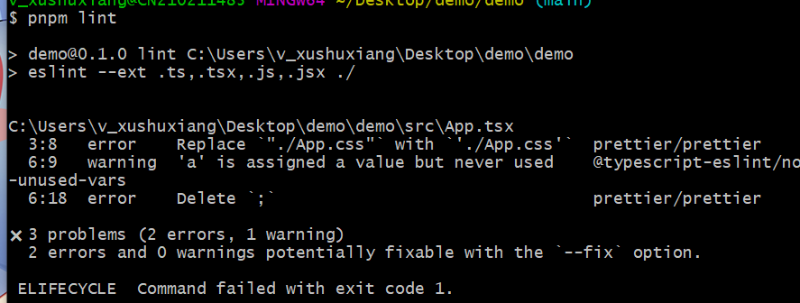
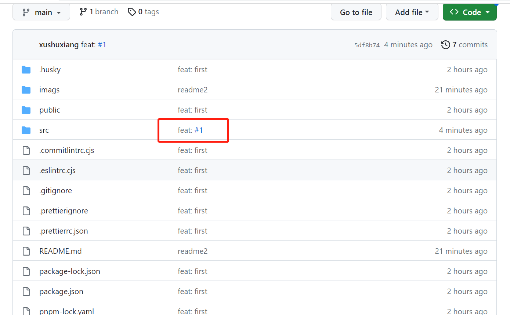
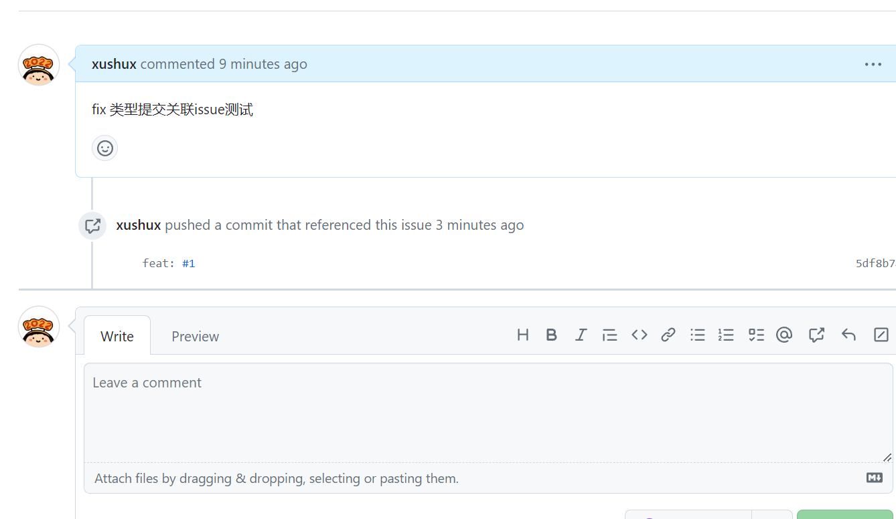
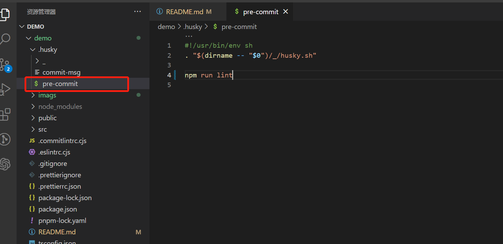
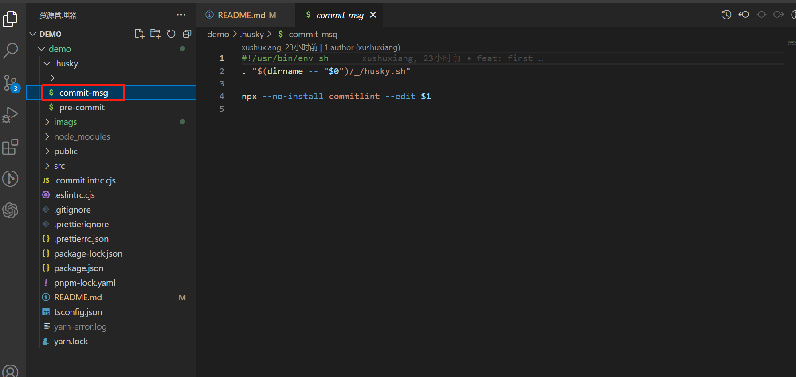

```bash
在大前端时代，前端的各种工具链穷出不断，有eslint, prettier, husky, commitlint 等
东西太多有的时候也是trouble😂😂😂,怎么正确的使用这个是每一个前端开发者都需要掌握的内容，请上车🚗🚗🚗
```

## eslint 使用

本次前端工程化的项目是基于 react 来的，vue 用户也是同样的道理，只是有个别的依赖包不一样。（）[eslint](https://zh-hans.eslint.org/docs/latest/use/getting-started)

```bash
"eslint": "^8.33.0",  // 这个是eslint的主包
"eslint-plugin-react": "^7.32.2",  // 这是react基于eslint来做的语法规范插件
"eslint-plugin-react-hooks": "^4.6.0", // 这是 react-hooks 语法基于eslint做的插件
"@typescript-eslint/eslint-plugin": "^5.50.0",  // typescript 基于eslint来做的插件
"@typescript-eslint/parser": "^5.50.0",  // typescript 基于eslint做的语法解析器，使得eslint可以约束ts语法
```

使用的以下语句来按照依赖：

```bash
pnpm i eslint eslint-plugin-react eslint-plugin-react-hooks @typescript-eslint/parser @typescript-eslint/eslint-plugin -D
```

接下来需要对 eslint 的规范写入配置文件中，可以在项目的根目录下面建立一个 `.eslintrc.cjs`

```bash
module.exports = {
    'env': {
        'node': true,   // 标志当前的环境，不然使用module.exports 会报错
        'es2021': true
    },
    extends: [
      'eslint:recommended',  // 使用eslint推荐的语法规范
      'plugin:react/recommended',  // react推荐的语法规范
      'plugin:@typescript-eslint/recommended' // ts推荐的语法规范
    ],
    parser: '@typescript-eslint/parser',  // 使用解析器来解析ts的代码，使得eslint可以规范ts的代码
    parserOptions: {
      ecmaFeatures: {
        jsx: true  // 允许使用jsx的语法
      },
      ecmaVersion: 'latest',  // es的版本为最新版本
      sourceType: 'module'  // 代码的模块化方式，使用module的模块方式
    },
    plugins: ['react', '@typescript-eslint', 'react-hooks'],  // 使用对应的react, react-hooks, @typescript-eslint 等插件
    rules: {
      quotes: ['error', 'single'],  // 配置单引号的规则，如果不是单引号，报错
      semi: 'off',  //  不需要使用分号；
      trailingComma: 'none',  // 参数后面不允许使用分号
      arrowParens: 'avoid', // 要求箭头函数的参数使用圆括号
      tabWidth: 2,
      printWidth: 120
      'react/react-in-jsx-scope': 'off'  // 在jsx中不需要导入 react的包
    }
  }
```

接下来在 package.json 的 scripts 中加入一条命令

```bash
"lint": "eslint --ext .ts,.tsx,.js,.jsx ./" // 使用eslint 规范 ts,tsx,js,jsx的代码
```

### 效果



代码中的不规范的格式就暴露出来了，现在可以来修复并且格式化代码。在格式化代码方面，prettier 做的更好点

## prettier

`prettier` 是一款开源的代码格式化包，支持多种代码编写工具，常见的 `vscode, webstorm` 等，他都是支持的，那么怎么给他集成起来呢？

使用下面语句来安装依赖：

```bash
pnpm i prettier eslint-plugin-prettier eslint-config-prettier
```

```bash
"prettier": "^2.8.3",  // prettier 主包
"eslint-config-prettier": "^8.6.0",  // eslint 和prettier的共同配置
"eslint-plugin-prettier": "^4.2.1",  // 在eslint当中，使用prettier为插件，才能一起使用
```

安装好依赖后，咱们还需要在 `eslitrc.cjs`中加入 prettier 的配置如下：

```bash
{
 extends:[
 ...,
+ 'prettier', // prettier
+ 'plugin:prettier/recommended' // prettier推荐的配置
 ],
+ plugins:[...,'prettier'],
rules: {
+    'prettier/prettier': 'error', // eslint 和prettier 用prettier的错误
    }
}
```

接下来在`package.json`中添加一段脚本

```bash
+ "prettier": "eslint --fix --ext .ts,.tsx,.js,.jsx --quiet ./"
```

此时，咱们还需要配置哪些文件是不需要进行代码格式化的，所以在根目录下面建立 `.prettierignore`增加如下内容

```bash
node_modules
package.json
pnpm-lock.yaml
dist
```

### 效果


修复成功，但是这里还报了一个警告，这个的解决办法如下：

在`eslintrc.cjs`的最后增加上一段配置如下：

```bash
+ settings: {
+    react: {
+      version: 'detect'
+    }
+  }
```


配置自动格式化


# commitizen + husky + commitlint

React 项目 commitizen + husky + commitlint，git commit 提交信息规范校验 demo，[conventional commits](https://www.conventionalcommits.org/en/v1.0.0/) 实践

- `commitizen`：使用 git cz 代替 git commit，引导用户填写规范的 commit 信息
- `husky + commitlint`：git commit 动作时，校验 commit 信息，如果不满足 commitizen 规范，无法提交

## commitizen 使用

[commitizen](https://github.com/commitizen/cz-cli) 是一个 cli 工具，用于规范化 git commit 信息，可以代替 git commit

```bash
pnpm install -g commitizen cz-conventional-changelog  # 安装规范化提交插件

"config": {
  "commitizen": {
    "path": "./node_modules/cz-conventional-changelog"
  }
}

git cz
PS C:\Users\v_xushuxiang\Desktop\demo\demo> git cz
cz-cli@4.3.0, cz-conventional-changelog@3.3.0

? Select the type of change that you're committing: feat:     A new feature
? What is the scope of this change (e.g. component or file name): (press enter to skip) test
? Write a short, imperative tense description of the change (max 88 chars):
 (11) test updata
? Provide a longer description of the change: (press enter to skip)

? Are there any breaking changes? No
? Does this change affect any open issues? No
[main 9fc4737] feat(test): test updata
 Committer: xushuxiang <v_xushuxiang@bilibili.com>
```


如图，git cz 运行后，会有如下 6 个步骤

### 1.选择提交类型(必填)

Select the type of change that you're committing: (Use arrow keys)

| 类型     | 描述                                                                                                        |
| -------- | ----------------------------------------------------------------------------------------------------------- |
| feat     | A new feature                                                                                               |
| fix      | A bug fix                                                                                                   |
| docs     | Documentation only changes                                                                                  |
| style    | Changes that do not affect the meaning of the code (white-space, formatting, missing semi-colons, etc)      |
| refactor | A code change that neither fixes a bug nor adds a feature                                                   |
| perf     | A code change that improves performance                                                                     |
| test     | Adding missing tests or correcting existing tests                                                           |
| build    | Changes that affect the build system or external dependencies (example scopes: gulp, broccoli, npm)         |
| ci       | Changes to our CI configuration files and scripts (example scopes: Travis, Circle, BrowserStack, SauceLabs) |
| chore    | Other changes that don't modify src or test files                                                           |
| revert   | Reverts a previous commit                                                                                   |

### 2.选择 scope 模块名(选填)

What is the scope of this change (e.g. component or file name): (press enter to skip)

### 3.填写精炼的提交信息(必填)

Write a short, imperative tense description of the change (max 86 chars):

### 4.填写补充信息(选填)

Provide a longer description of the change: (press enter to skip)

### 5.选择是否有破坏性更新(默认 no)

Are there any breaking changes?

### 6.是否关联是 open 状态的 issue(默认 no)

Does this change affect any open issues?

可以关闭 github issue，**但注意 commit 信息里面的末尾也要加 '(#issue 编号)'**，这样在 github 体验更好

## docs 类型提交

```bash
# 修改 README.md
git add . # 添加到 git
git cz # 提交
# ? Select the type of change that you're committing: docs:     Documentation only changes
# ? What is the scope of this change (e.g. component or file name): (press enter to skip) readme
# ? Write a short, imperative tense description of the change (max 86 chars):
# (46) update readme.md, add init project description
# ? Provide a longer description of the change: (press enter to skip)

# ? Are there any breaking changes? No
# ? Does this change affect any open issues? No
# [main caae82e] docs(readme): update readme.md, add init project description
# 1 file changed, 7 insertions(+)
# C:\Users\v_xushuxiang\Desktop\demo\demo> demo %
```

查看提交信息

```bash
PS C:\Users\v_xushuxiang\Desktop\demo\demo> % git log
commit caae82ec7beb66423f190ab86a6343447b250046 (HEAD -> main)
Author: v_xushuxiang <v_xushuxiang@bilibili.com>
Date:   Thu Oct 14 07:17:31 2021 +0800

    docs(readme): update readme.md, add init project description
```

## fix 类型提交

在 github 仓库提交一个 issue，看是否提交 fix 时，可以关联这个 issue

创建一个 issue [fix type 提交类型关联测试 1](https://github.com/xushux/demo/issues?q=is%3Aissue+is%3Aclosed)

```bash
git cz
cz-cli@4.2.4, cz-conventional-changelog@3.2.0

# ? Select the type of change that you're committing: fix:      A bug fix
# ? What is the scope of this change (e.g. component or file name): (press enter to skip) tests
# ? Write a short, imperative tense description of the change (max 88 chars):
#  (17) update tests (#2)
# ? Provide a longer description of the change: (press enter to skip)

# ? Are there any breaking changes? No
# ? Does this change affect any open issues? No
# [main 821cd42] fix(tests): update tests (#2)
#  1 file changed, 2 insertions(+)

#  fix(tests): update tests (#2)
```

提交时选择是否影响了 open 状态的 issue，如果选择了，github 会自动关闭该 issue

```bash
PS C:\Users\v_xushuxiang\Desktop\demo\demo> % git cz
cz-cli@4.2.4, cz-conventional-changelog@3.2.0

# ? Select the type of change that you're committing: fix:      A bug fix
# ? What is the scope of this change (e.g. component or file name): (press enter to skip) public
# ? Write a short, imperative tense description of the change (max 87 chars):
#  (28) auto close github issue test
# ? Provide a longer description of the change: (press enter to skip)

# ? Are there any breaking changes? No
# ? Does this change affect any open issues? Yes
# ? If issues are closed, the commit requires a body. Please enter a longer description of the commit itself:
#  try to fix issue 2, just a msg
# ? Add issue references (e.g. "fix #123", "re #123".):
#  fix #2
# [main 146e7b9] fix(public): auto close github issue test
#  1 file changed, 1 insertion(+)
# PS C:\Users\v_xushuxiang\Desktop\demo\demo> %
```

注意：如果 commit 信息里面后面不加 (#issue 编号)，git commit 表面是看不出来的，只有点击去才行



该提交会关闭 #1 issue，注意 issue 详情里会自动关联 commit 信息中有 #issue 编号的提交，如下图，



## husky + commitlint 提交校验

[commitlint](https://github.com/conventional-changelog/commitlint) 结合 husky 可以在 git commit 时校验 commit 信息是否符合规范

### husky 安装

1. 安装 husky

```bash
pnpm install husky --save-dev
```

2. 安装 husky git hooks

我们在终端通过 `npx husky install` 来初始化 `husky`


3. 测试 husky 钩子作用，添加 pre-commit 钩子

我们还需要生成`pre-commit`钩子的时候来执行`npm run lint`

```bash
npx husky add .husky/pre-commit "npm run lint"  // 在commit之前先执行 npm run lint脚本
```

安装完成后，会在 `.husky` 目录中新增一个文件 `pre-commit`



需要在 package.json 注册 prepare 命令，在项目进行 pnpm i 之后就行 Huksy 的安装，命令如下:

```bash
+ "prepare": "husky install"
```

上面是自己手动 npx husky install 的，需要让后面使用配置的人自动来初始化 husky

但是大家如果再深入一步，就会想到 🤔🤔🤔。既然我内容都管控好了，是不是需要把 commit -m 'xxx' 中的 msg 也管控下呀 😉😉😉

## commitlint 安装配置

```bash
pnpm i commitlint @commitlint/cli @commitlint/config-conventional -D
```

包意思解析

```bash
 "@commitlint/cli": "^17.4.2", // 规范提交信息
 "@commitlint/config-conventional": "^17.4.2",  // commitlint 常用的msg配置
 "commitlint": "^17.4.2" // commitlint 主包
```

根目录添加一个 `.commitlintrc.cjs`来配置`commitlint`的配置:

```bash
module.exports = {
  extends: ['@commitlint/config-conventional']
}
```

还需要在 git hooks 中添加一个方法

```bash
npx husky add .husky/commit-msg 'npx --no-install commitlint --edit "$1"'
```

然后会在`.husky`中生成一个新的文件`commit-msg`



测试

```bash
$ git add .
$ git commit -m 'xxx'

> testproject@0.1.0 lint
> eslint --ext .ts,.tsx,.js,.jsx ./

⧗   input: xxx
✖   subject may not be empty [subject-empty]
✖   type may not be empty [type-empty]

✖   found 2 problems, 0 warnings
ⓘ   Get help: https://github.com/conventional-changelog/commitlint/#what-is-commitlint

husky - commit-msg hook exited with code 1 (error)

```

提示缺少 subject 就是提交信息、type 就是提交类型，按照规范提交就 ok 了

# lint-staged

对于细心的同学可能会发现，我们每一次提交都会 `prettier`整个目录的所有问题，大大的降低了咱们编码的速度。所以咱们还需要做一件事情，那就是 只格式化需要提交的代码，其他的就不需要格式化了

使用下面命令安装依赖

```bash
pnpm i lint-staged -D
```

然后在 package.json 中新增如下内容

```bash
+ "lint-staged": {
+     "**/*.{js,jsx,tsx,ts}": [
+          "eslint --fix"
+       ]
+    }
```

还需要对 pre-commit 这个钩子就行修改内容

```bash
#!/usr/bin/env sh
. "$(dirname -- "$0")/_/husky.sh"

- npm run lint
+ npx --no -- lint-staged
```

## 根据 commit 信息生成 changelog

### 手动生成 changelog(不推荐)

注意：该方法结合 npm version 时，生成会有问题，建议使用后面的 standard-version 自动生成，自动 tag，自动 commit

```
$ pnpm install -g conventional-changelog-cli
$ cd my-project
$ conventional-changelog -p angular -i CHANGELOG.md -s
```

注意：默认版本是 package.json 中的 version 参数: "version": "0.1.0", 如果版本变更，需要使用 npm version '版本号'，修改版本号，再生成

```bash
npm version 0.2.0 # 修改 package.json 版本号，并打一个 tag，待 push，commit 信息 0.0.2
git push origin --tags # push tags
git commit --amend -m 'feat(version):version to 0.2.0' # commit 信息不对，导致生成 log 有问题，需要修改
# 修上次提交记录，把 0.2.0 改为标准格式再生成，就可以生成 change log 了
```

npm version 时加上比较好的注释试试

```bash
PS C:\Users\v_xushuxiang\Desktop\demo\demo> % npm version 0.4.0 -m 'feat(version):0.4.0 tag remark'
v0.4.0
PS C:\Users\v_xushuxiang\Desktop\demo\demo> % git log
commit 0fdcd82353f3907c4a31e470402b6dce743b4b11 (HEAD -> main, tag: v0.4.0)
Author: v_xushuxiang <v_xushuxiang@bilibili.com>
Date:   Fri Oct 15 06:58:20 2021 +0800

    feat(version):0.4.0 tag remark

# 再次生成 changelog 又不行了，空白
```

## standard-version（自动生成、打 tag）

上面的例子中，npm run version 更新版本号会直接提交，导致且 commit 信息就是版本号，不符合 commitizen 规范。导致手动生成 log 时，会是空白。[standard-version](https://github.com/conventional-changelog/standard-version) 就很好的解决了这个问题。安装后，只需要 npm run release，就可以有 npm run version 的功能，而且提交信息是标准的 commitizen 规范，而且自动生成 changelog 自动打 tag，自动 commit。你只需要 push 即可。

```bash
pnpm install standard-version --save-dev
```

scripts 设置

```js
// scripts
"release": "standard-version"
```

```bash
$ npm run release

> demo@0.1.0 release
> standard-version

√ bumping version in package.json from 0.1.0 to 0.1.1
√ bumping version in package-lock.json from 0.1.0 to 0.1.1
√ created CHANGELOG.md
√ outputting changes to CHANGELOG.md
√ committing package-lock.json and package.json and CHANGELOG.md
√ tagging release v0.1.1
i Run `git push --follow-tags origin main` to publish

# git push
# git push --tags
```

需要注意的是：**CHANGELOG.md 是追加写入内容的，如果你之前没有对应的内容或删了之前的内容，会导致生成的内容较少，或者不完整。**

### release 特定版本

```bash
# 0.4.1
npm run release # 0.4.1 => 0.4.2
npm run release -- --prerelease # 0.4.2 to 0.4.3-0
npm run release # 0.4.3-0 to 0.4.3
npm run release -- --prerelease alpha # 0.4.3 to 0.4.4-alpha.0

# patch、minor、major
npm run release -- --release-as minor  # 0.4.4-alpha.0 to 0.5.0
npm run release -- --release-as patch # 0.5.0 to 0.5.1
npm run release -- --release-as major # 0.5.1 to 1.0.0
npm run release -- --release-as prepatch # 1.0.0 to 1.0.1-0
npm run release -- --release-as preminor # 1.0.1-0 to 1.1.0-0
npm run release -- --release-as premajor # 1.1.0-0 to 2.0.0-0

# 手动指定版本
npm run release -- --release-as 2.1.3-alpha.1 # 2.0.0-0 to 2.1.3-alpha.1
# ✔ bumping version in package.json from 2.0.0-0 to 2.1.3-alpha.1
# ✔ bumping version in package-lock.json from 2.0.0-0 to 2.1.3-alpha.1
# ✔ tagging release v2.1.3-alpha.1

npm run release # 2.1.3-alpha.1 to 2.2.0
```

对于版本号信息，参考 [npm version](https://docs.npmjs.com/cli/v7/commands/npm-version) 文档:

> The newversion argument should be a valid semver string, a valid second argument to [semver.inc](https://github.com/npm/node-semver#functions) (one of patch, minor, major, prepatch, preminor, premajor,
